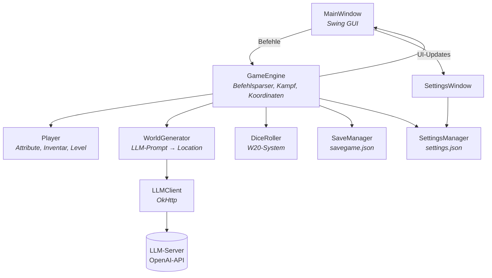

# Zork LLM - Fantasy Text-Adventure

Ein klassisches Text-Adventure im Stil von Zork, bei dem eine KI (LLM) die Spielwelt dynamisch generiert. Statt vorgefertigter Raeume erstellt das Sprachmodell jeden Ort, seine Beschreibung, Gegenstaende und Gegner zur Laufzeit.

[](https://github.com/DasPauluteli/zork-llm)
[](https://github.com/DasPauluteli/zork-llm/actions/workflows/maven.yml)
[](https://nightly.link/DasPauluteli/zork-llm/workflows/maven.yml/main/Zork-LLM-Windows-Portable.zip)
[](https://www.codefactor.io/repository/github/daspauluteli/zork-llm)

---

## Voraussetzungen

| Komponente | Version |
|---|---|
| Java | 25+ |
| Maven | 3.9+ |
| LLM-Server | OpenAI-kompatibler Endpunkt (z.B. llama.cpp, LM Studio, Ollama, Jan) |

---

## Installation & Start

```bash
# Repository klonen
git clone https://github.com/DasPauluteli/zork-llm.git
cd zork-llm

# Fat-JAR bauen
mvn package

# Anwendung starten
java -jar target/zork-llm-1.0-SNAPSHOT-jar-with-dependencies.jar
```

### Ersteinrichtung

1. **Einstellungen > API-Einstellungen** oeffnen
2. API-Endpunkt eingeben (z.B. `http://127.0.0.1:1337/v1`)
3. API-Schluessel eingeben (falls erforderlich)
4. **Modelle laden** klicken und ein Modell auswaehlen
5. **Speichern** klicken
6. **Spiel > Neues Spiel** starten

---

## Anwendungsstruktur

```
zork-llm/
├── src/main/java/de/zork/
│   ├── Main.java              # Einstiegspunkt, EDT-Start
│   ├── MainWindow.java        # Swing-Hauptfenster
│   ├── SettingsWindow.java    # API-Einstellungsdialog
│   ├── GameEngine.java        # Spiellogik & Befehlsparser
│   ├── WorldGenerator.java    # LLM-Prompt -> Location
│   ├── LLMClient.java         # OkHttp HTTP-Client (OpenAI API)
│   ├── Player.java            # Spielerattribute, Inventar, Level-Up
│   ├── Location.java          # Raumdaten (Ausgaenge, Items, Gegner)
│   ├── Item.java              # Gegenstaende mit Stateffekten
│   ├── Enemy.java             # Gegner mit D20-Kampfwerten
│   ├── DiceRoller.java        # W20-WuerfelSystem
│   ├── SaveManager.java       # Spielstand speichern/laden (JSON)
│   ├── SettingsManager.java   # Einstellungen (settings.json)
│   └── GameState.java         # Serialisierbarer Spielzustand
└── src/main/resources/
    └── GitHub_Invertocat_Black.png
```

### Komponentendiagramm



---

## Spielbefehle

| Befehl | Aktion |
|---|---|
| `nord`, `n` / `north` | Bewegen (auch sued/ost/west) |
| `inventar`, `i` | Inventar anzeigen |
| `aufheben <item>` | Gegenstand aufnehmen |
| `benutzen <item>` | Gegenstand benutzen |
| `angreifen <gegner>` | Kampf beginnen |
| `status` | Spielerwerte anzeigen |
| `speichern` / Strg+S | Spielstand speichern |
| `laden` / Strg+L | Spielstand laden |
| `hilfe` | Befehlsuebersicht |

---

## Technologien

- **Java 25** + **Swing** – Desktop-GUI
- **Jackson 2.18** – JSON-Serialisierung (Spielstand, LLM-Antworten)
- **OkHttp 4.12** – HTTP-Client fuer LLM-API-Aufrufe
- **Maven** – Build & Abhaengigkeiten (Fat-JAR via Assembly Plugin)
